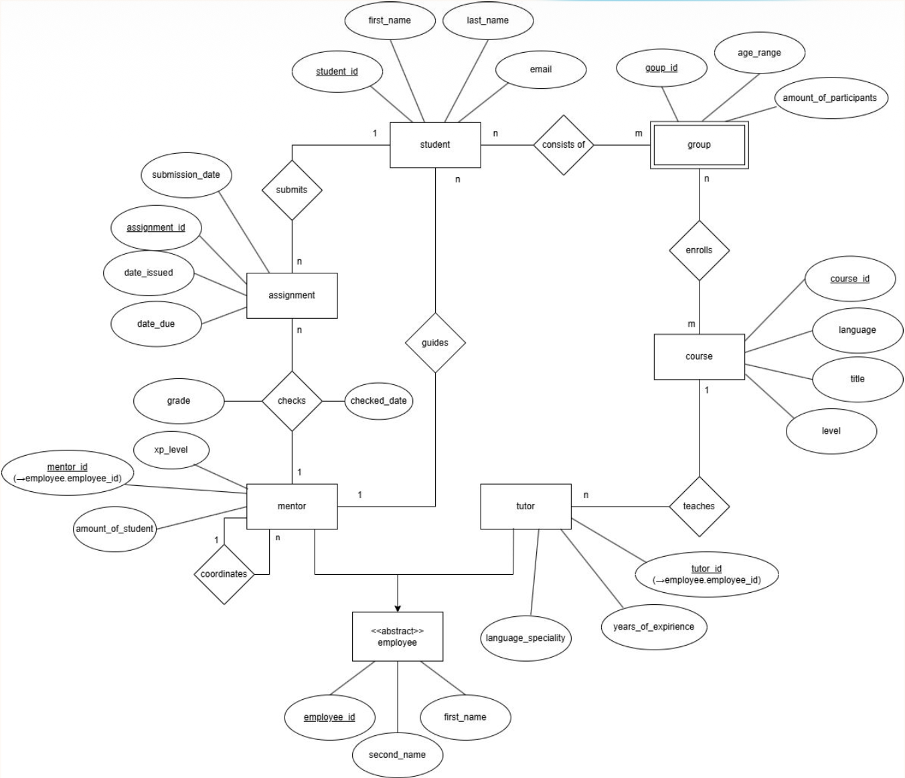
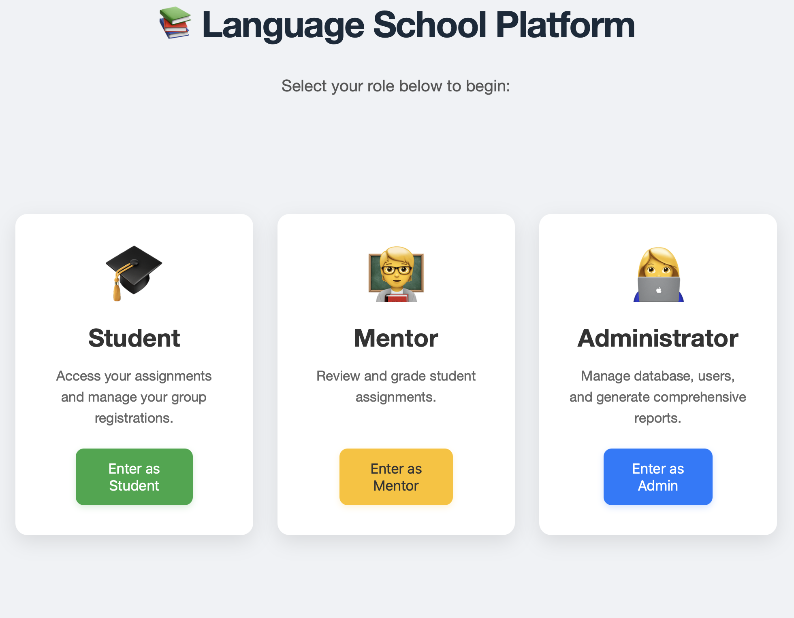

# Online Language School Management System

A fully containerized web application for managing an online language school.  
The system supports both relational (MariaDB) and NoSQL (MongoDB) backends and provides different functionality depending on the selected user role (Student, Mentor, Administrator).

This project was developed using:
- Flask (Python)
- MariaDB (SQL)
- MongoDB (NoSQL)
- Docker & Docker Compose


## Features

### Student Role
- Browse available courses
- Join a group (validated by age category and group capacity)
- Submit assignments
- View assignment details and submission status

### Mentor Role
- View which students submitted assignments
- Grade assignments with scores between 0–100
- See submission, due, and grading dates

### Administrator Role
- Switch between MariaDB and MongoDB mode
- Populate each database with generated sample data
- Migrate all data from MariaDB → MongoDB (via migration scripts)
- View analytics reports for both SQL and NoSQL:
  - Average age of students per course
  - Assignments graded above/below a threshold

---


# Screenshots

## ER Diagram

The ER diagram models all main entities of the language school system, including Student, Course, Group, Mentor, Tutor, Assignment, and their relationships.

<p align="left">
  
</p>

## Start Page

<p align="left">
  
</p>


## NoSQL: Course Collection

Each course stores embedded student groups with student IDs.  
course_id from SQL is removed because MongoDB uses _id.

Structure Example:

```json
{
  "language": "English",
  "title": "Academic English",
  "level": "C1",
  "tutor": "T1",
  "student_group": [
    {
      "student_group_id": "g1",
      "age_category": "Adult",
      "max_participant": 8,
      "students": ["s1", "s2", "s3"]
    },
    {
      "student_group_id": "g2",
      "age_category": "Teenager",
      "max_participant": 5,
      "students": ["s5", "s6", "s7"]
    }
  ]
}
```

## NoSQL: Student Collection

Students contain embedded assignment information and reference their mentor.  
Grading information is embedded in the assignment document.

Structure Example:

```json
{
  "student_id": "ST0001",
  "age": 18,
  "first_name": "Bob",
  "last_name": "Roger",
  "email": "bob20@gmail.com",
  "mentor_id": "MT0001",
  "assignments": [
    {
      "assignment_id": "AS0001",
      "date_issued": "2023-04-01",
      "date_due": "2023-04-10",
      "submission_date": "2023-04-01",
      "evaluation": {
        "grade": 94,
        "checked_date": "2023-04-01"
      }
    }
  ]
}
```

## NoSQL: Employee Collection

Mentors and tutors are merged into a single collection using a role field.

Structure Example:

```json
[
  {
    "employee_id": "MT0001",
    "first_name": "Bob",
    "last_name": "Roger",
    "role": "mentor",
    "xp_level": 10,
    "amount_of_students": 10,
    "supervise": "MT0005"
  },
  {
    "employee_id": "TU0001",
    "first_name": "Alice",
    "last_name": "Margine",
    "role": "tutor",
    "years_of_experiece": 10,
    "language_speciality": "French"
  }
]
```


---

## How to Run the Application

### 1. Clone the repository
```bash
git clone git@github.com:woullufy/LanguageSchool.git
cd LanguageSchool/docker
docker compose up --build
```

### 2. Open the application in your browser
```bash
http://127.0.0.1:5050
```
